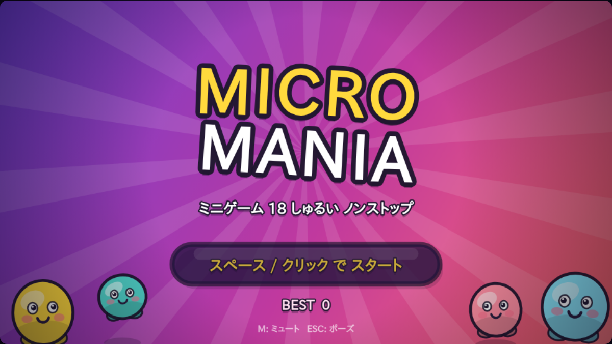

# MICRO MANIA



命令語が出る → 数秒で終わる → すぐ次。
メイドインワリオ／リズム天国のテンポ感を狙った、**ミニゲーム 18 種のノンストップ ゲーム**です。

ブラウザだけで動きます。**インストール不要・ビルド不要・外部依存ゼロ・完全オフライン**。
画像も音声ファイルも一切使わず、グラフィックは Canvas、サウンドは WebAudio で
すべて実行時に生成しています。

---

## あそぶ

`index.html` をブラウザで開くだけです。

```
git clone <this repo> && cd AAA-
xdg-open index.html      # macOS なら open index.html
```

ローカルサーバー経由で開きたい場合:

```
npx http-server . -p 8080     # → http://localhost:8080
```

### そうさ

| | キーボード | マウス / タッチ |
|---|---|---|
| うごかす | ← → ↑ ↓ / WASD | ドラッグ |
| きめる・とぶ・たたく | スペース / Enter / Z | クリック / タップ |
| ねらう | — | クリック / タップ |
| ポーズ | ESC | — |
| ミュート | M | — |

命令語が出たあとに操作ヒントのアイコンが出るので、初見でも何をすればいいかわかります。

### ルール

- ライフは 4。ミニゲームを失敗すると 1 つ減り、0 でゲームオーバー。
- 4 ゲームごとに **SPEED UP**。BGM も演出もミニゲーム内の時間も、まとめて速くなります。
- 6 ゲームごとに **BOSS STAGE**（長めの 1 本勝負）。
- スコアはクリアしたミニゲームの数。ベスト記録はブラウザに保存されます。

---

## ミニゲーム一覧（18 種）

| 命令語 | 内容 | 操作 |
|---|---|---|
| よけろ！ | 落ちてくるトゲ玉をかわしきる | 移動 |
| あつめろ！ | 落ちてくる星をカゴで全部受ける | 移動 |
| たたけ！ | 顔を出したヤツを叩く（ばくだんは NG） | 狙う |
| とべ！ | 障害物をジャンプでかわす | 押す |
| れんだ！ | 連打でライバルを押し切る | 連打 |
| かぞえろ！ | 数を数えて正しい数字を選ぶ | 選ぶ |
| とめろ！ | 往復する針をゾーンで止める | 押す |
| うて！ | 動く的を全部うち抜く | 狙う |
| あわせろ！ | 拍に合わせて押す | 押す |
| ささえろ！ | 頭の棒を倒さないよう支える | 移動 |
| つかめ！ | 流れてくるお宝をワクでつかむ | 押す |
| のばせ！ | 橋を伸ばして向こう岸に届かせる | 長押し |
| さがせ！ | 1 つだけ違うヤツを見つける | 選ぶ |
| ふせげ！ | 飛んでくる側にタテを向ける | 方向 |
| にげろ！ | レーザーをかわして EXIT へ | 移動 |
| はらえ！ | 飛び回る虫をはたき落とす | 狙う |
| **たえろ！** | BOSS: 3 段階の弾幕を生き延びる | 移動 |
| **きめろ！** | BOSS: リズム譜を最後まで叩ききる | 押す |

難易度は進行に応じて 3 段階（出現数・速度・判定幅）で変化します。

---

## つくり

設計上の取り決めは [ARCHITECTURE.md](ARCHITECTURE.md) にまとめてあります。要点だけ:

- **論理解像度 960×540 固定**、レターボックスで DPR 対応。更新は固定 1/60 秒。
- **進行はすべてビート単位**。BPM を上げると演出も BGM もゲーム内時間も同時に速くなる（`speed` 一本で制御）。
- **乱数はシード付き RNG のみ**（`Math.random()` はコードベースで未使用）。同じ状況を再現できます。
- ミニゲームは 1 ファイル 1 本、互いを一切参照しません。追加は `GG.reg({...})` を呼ぶだけ。

```
src/core/       エンジン層（ゲーム内容を知らない）
src/microgames/ ミニゲーム 18 本
tools/          QA スクリプト
```

### ミニゲームを足す

`src/microgames/mygame.js` を作って `index.html` に `<script>` を 1 行足すだけです。

```js
GG.reg({
  id: 'mygame', verb: 'おせ！', verbEn: 'PUSH!',
  control: 'press', beats: 8, bg: ['#ff9f43', '#b33771'],
  create: function (c) {
    return {
      update: function (dt) { if (c.input.actHit) c.win(); },
      draw: function (g) { g.text('おして！', c.W / 2, 270, { size: 48 }); }
    };
  }
});
```

`c.rng` は必ず使ってください（`Math.random()` は禁止）。API の詳細は ARCHITECTURE.md の 2 章。

---

## 開発・QA

Node.js と Playwright があれば、実際にブラウザで走らせて検証できます。

```
node tools/qa.js              # 全ミニゲームのプレイ画面を qa-shots/ に撮る + エラー収集
node tools/qa.js dodge 3      # 1 本だけ / 難易度 3
node tools/sheet.js           # 撮った画像を 1 枚のコンタクトシートに合成
node tools/playtest.js        # ページ内で自動プレイヤーを走らせ、全難易度でクリア可能か検証
```

`playtest.js` は「ちゃんと操作すればクリアできるか」を 60fps でブラウザ内から検証します。
実際にこれで、**カゴが物理的に間に合わない星の配置**や、
**時間内にワクへ届かないお宝**といったクリア不能バグを見つけて直しました。
